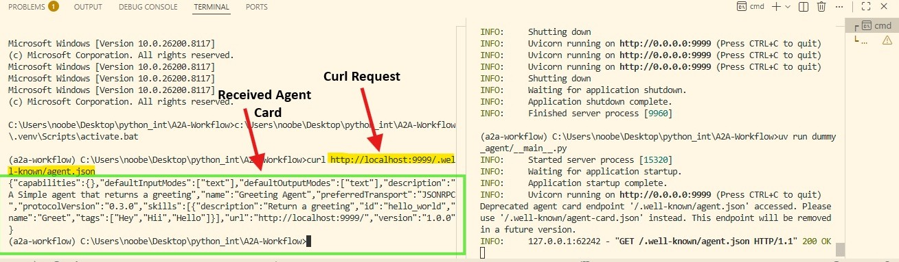
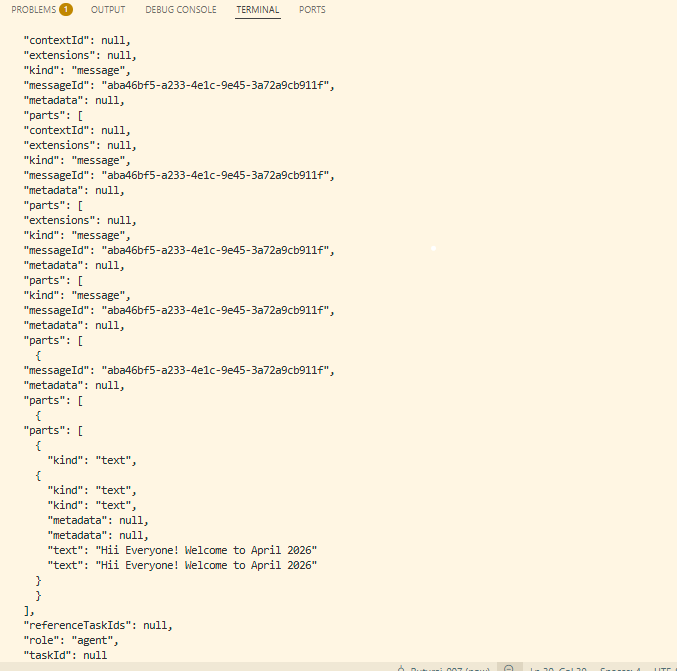

# a2a-workflow

This project demonstrates a simple Agent-to-Agent (A2A) workflow using the `a2a-sdk`. It implements a basic "Greeting Agent" server and a client to interact with it, showcasing how to build and consume agents using the A2A protocol.

# Agent Card

# Workflow


## Features

- **Greeting Agent**: A simple agent that responds with a greeting message.
- **A2A Server**: Built using `starlette` and `uvicorn`, exposing the agent via the A2A protocol.
- **A2A Client**: A client script that discovers the agent via its Agent Card and sends a message.
- **Modern Tooling**: Uses `uv` for fast Python package and project management.

## Prerequisites

- Python 3.11 or higher
- [uv](https://github.com/astral-sh/uv) (An extremely fast Python package installer and resolver)

## Installation

1.  **Clone the repository:**

    ```bash
    git clone <repository-url>
    cd a2a-workflow
    ```

2.  **Install dependencies using `uv`:**

    This project uses `uv` to manage dependencies. Run the following command to create a virtual environment and install the required packages defined in `pyproject.toml`.

    ```bash
    uv sync
    ```

## Usage

To see the agent in action, you will need to run the server in one terminal and the client in another.

### 1. Start the Agent Server

The server hosts the "Greeting Agent" on `http://localhost:9999`.

Run the server using the module entry point:

```bash
uv run -m dummy_agent
```

You should see output indicating that `uvicorn` is running:
```text
INFO:     Started server process [...]
INFO:     Waiting for application startup.
INFO:     Application startup complete.
INFO:     Uvicorn running on http://0.0.0.0:9999 (Press CTRL+C to quit)
```

### 2. Run the Client

The client connects to the server, retrieves the Agent Card, and sends a test message.

Open a new terminal window and run:

```bash
uv run dummy_agent/client.py
```

**Expected Output:**

```text
Agent Card {
  "name": "Greeting Agent",
  "description": "A simple agent that returns a greeting",
  ...
}
A2A Client Initialized
Response {
  ...
  "content": "Hi Everyone! Welcome to AI with Hassan."
  ...
}
```

## Project Structure

- **`dummy_agent/`**: Contains the source code for the agent and client.
    - **`__main__.py`**: The entry point for the server. Configures the `AgentCard`, `AgentSkill`, and starts the `A2AStarletteApplication`.
    - **`agent_executor.py`**: Defines the `GreetingAgent` logic and the `GreetingAgentExecutor` which handles the execution context.
    - **`client.py`**: A client script that uses `a2a.client` to communicate with the running agent.
- **`main.py`**: A simple placeholder script.
- **`pyproject.toml`**: Project configuration and dependencies.

## Development

This project uses `uv` for dependency management.

- **Add a dependency:**
  ```bash
  uv add <package-name>
  ```

- **Run a script in the virtual environment:**
  ```bash
  uv run <script.py>
  ```

- **Update dependencies:**
  ```bash
  uv lock --upgrade
  ```